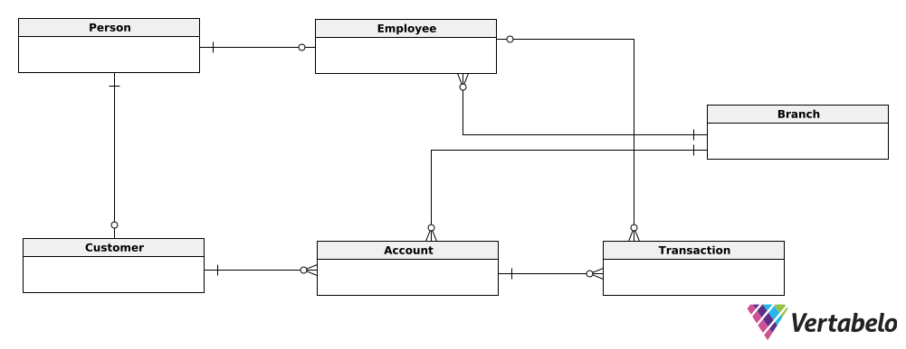

# Проект "Банковская система"

---

## Концептуальная модель

---

## Логическая модель

---

## Сущности

`BankSystem.Address`
В целях нормализации, вынес адрес в отдельную сущность, поскольку он включает в себя несколько полей : город, улица, номер дома

`BankSystem.Person` 
В этой таблице хранится базовая информация как о клиентах, так и о работниках : имя, фамилия, номер телефона, адрес, email, дата рождения

`BankSystem.Customer`
Надстройка над сущностью Person, имеет внешний ключ person_id, помимо этого есть поле тип клента - common, premium

`BankSystem.Employee`
Надстройка над сущностью Person, имеет внешний ключ person_id, помимо этого есть поля : id отдела и id должности, а также период в течении которого этот сотрудник работал в банке (SCD 2)

`BankSystem.Position`
Содержит информацию о позициях сотрудников банка : название, зарплата, и так же период в течении которого эта позиция была актуальна (SCD 2). Также вынес в отдельную сущность после нормализации

`BankSystem.Branch`
Содержит информацию об отделах банка - название, адрес, номер телефона. Является отдельной сущностью ввиду нормализации

`BankSystem.Account`
Эта сущность отвечает за счета клиентов в банке, поля : тип счёта (депозитный, кредитный, валютный), id клиента, id отдела в котором этот счёт открыт, текущий баланс а также период в течении которого счёт был открыт (SCD 2)

`BankSystem.Transaction`
Эта таблица содержит информацию о транзакциях : id счёта, id сотрудника который совершал эту операцию, сумма операции (если операция снятия, то сумма отрицательная) и её время. Операцию перевода между счетами можно представить в виде композиции двух базовых операций - снятие суммы с одного счёта и пополнение на ту же сумму на другом счёте

---

БД имеет 3 НФ.